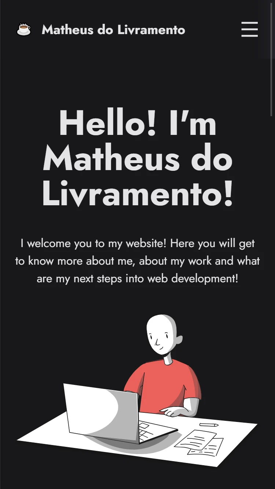
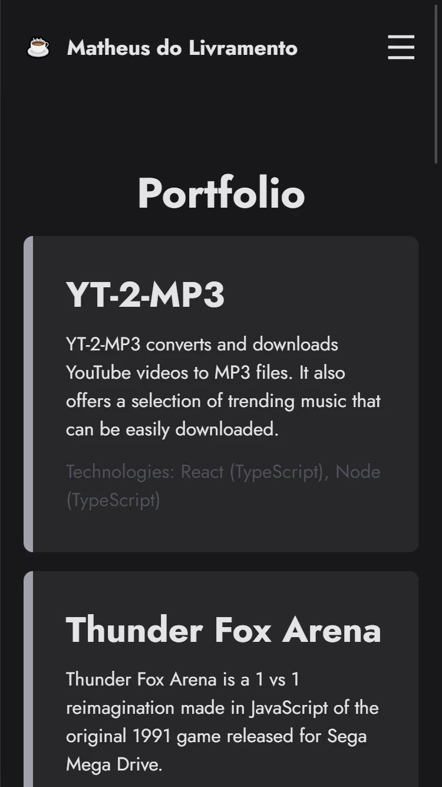
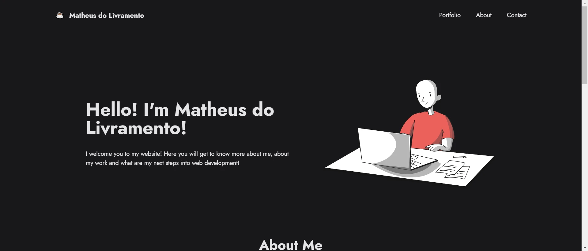
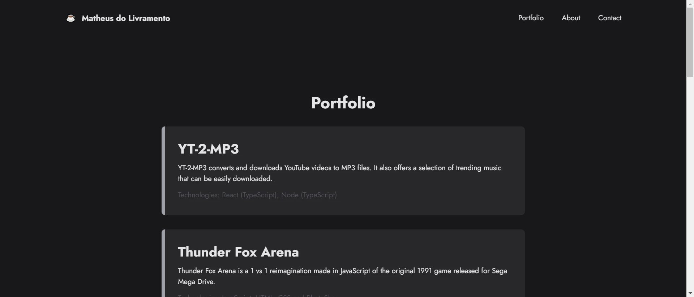

<h1 align="center">Livramento's Portfolio</h1>

<ul>
    <li><a href="#english-documentation">English documentation</a></li>
    <li><a href="#documentação-em-português">Documentação em português</a></li>
</ul>

<h1 id="english-documentation">English Documentation</h1>

<h2>📜 Table of content</h2>

<!--ts-->
<ul>
    <li><a href="#about-the-project">About the project</a></li>
    <li><a href="#live-demo">Live demo</a></li>
    <li><a href="#front-end">Front-end</a></li>
    <ul>
        <li><a href="#layout">Layout</a></li>
        <li><a href="#technologies-front">Technologies</a></li>
    </ul>
    <li><a href="#inspirations">Inspirations</a></li>
    <li><a href="#author">Author</a></li>
</ul>
<!--te-->

<h2 id="about-the-project">💻 About the project</h2>

    This is my personal portfolio, built with Next.js, Tailwind and TypeScript. One of my main goals, other than presenting my own work is deliver a solid product, being fast with no loading times.

    Another point I had in mind during development was to use as few third-party libraries as possible, in order to keep the architecture as "self-contained" as possible (and with the advantage of not being bothered every day by the dependabot).

<h2 id="live-demo">🌐 Live demo</h2>

Check out this project running on <a href="https://www.livramento.dev/">Vercel</a>

<h2 id="front-end">Front-end</h2>

The client side of Livramento.dev is fully responsive. Check its layout below:

<h3 id="layout">📐 Layout</h3>

<h4>Mobile</h4>

    
    

<h4>Desktop</h4>

    
    

<h3 id="technologies-front">🔨 Technologies</h3>

The following technologies were used to build the application's front-end:

<ul>
  <li>Next.js</li>
  <li>Tailwind CSS</li>
  <li>Typescript</li>
  <li>react-icons</li>
  <li>date-fns</li>
  <li>eslint</li>
</ul>

<h3 id="inspirations">😁 Inspirations</h3>

This portfolio was inspired by the following projects:

<ul>
    <li><a href="https://www.figma.com/community/file/824810955262478067">Ryan Warner Codes, by Ryan Warner</a></li>
    <li><a href="https://youtu.be/27JtRAI3QO8">Personal Portfolio Website, by Bedimcode</a></li>
</ul>

<h3 id="author">👩‍🦲 Author</h3>

Full stack developed by <strong>Matheus do Livramento</strong>.

<a href="https://github.com/livramatheus">GitHub</a> | <a
        href="https://www.linkedin.com/in/livramatheus">LinkedIn</a> | <a
        href="https://www.livramento.dev/">Website</a>

<h1 id="documentação-em-português">Documentação em português</h1>
<h2>📜 Tabela de conteúdo</h2>

<ul>
    <li><a href="#about-the-project-br">Sobre o projeto</a></li>
    <li><a href="#live-demo-br">Live demo</a></li>
    <li><a href="#front-end-br">Front-end</a></li>
    <ul>
        <li><a href="#layout-br">Layout</a></li>
        <li><a href="#technologies-front-br">Tecnologias</a></li>
    </ul>
    <li><a href="#inspirations-br">Inspirações</a></li>
    <li><a href="#autor-br">Autor</a></li>
</ul>

<h2 id="about-the-project-br">💻 Sobre o projeto</h2>

    Este é o meu portfólio pessoal, desenvolvido com Next.js, Tailwind e TypeScript. Um dos meus principais objetivos, além de apresentar o meu próprio trabalho, é entregar um produto sólido, sendo rápido e sem tempos de carregamento.

    Outro ponto que tive em mente durante o desenvolvimento,
    foi de usar o mínimo de bibliotecas de terceiros, a fim 
    de manter a arquitetura o mais "self-contained" possível
    (e com a vantagem de não ser incomodado todo dia pelo Dependabot).

<h2 id="live-demo-br">🌐 Live demo</h2>

Veja este projeto rodando no <a href="https://www.livramento.dev/">Vercel</a>

<h2 id="front-end-br">Front-end</h2>

O lado do cliente de <strong>Livramento.dev</strong> é totalmente responsivo. Veja a seguir seu layout:

<h3 id="layout-br">📐 Layout</h3>

<h4>Mobile</h4>

    
    

<h4>Desktop</h4>

    
    

<h3 id="technologies-front-br">🔨 Tecnologias</h3>

As seguintes tecnologias foram utilizadas para construir o front-end da aplicação:

<ul>
  <li>Next.js</li>
  <li>Tailwind CSS</li>
  <li>Typescript</li>
  <li>react-icons</li>
  <li>date-fns</li>
  <li>eslint</li>
</ul>

<h3 id="inspirations-br">😁 Inspirações</h3>

Este portfolio foi inspirado pelos seguintes projetos:

<ul>
    <li><a href="https://www.figma.com/community/file/824810955262478067">Ryan Warner Codes, by Ryan Warner</a></li>
    <li><a href="https://youtu.be/27JtRAI3QO8">Personal Portfolio Website, by Bedimcode</a></li>
</ul>

<h3 id="autor-br">👩‍🦲 Autor</h3>

Full stack desenvolvido por <strong>Matheus do Livramento</strong>.

<a href="https://github.com/livramatheus">GitHub</a> | <a
        href="https://www.linkedin.com/in/livramatheus">LinkedIn</a> | <a
        href="https://www.livramento.dev/">Website</a>
